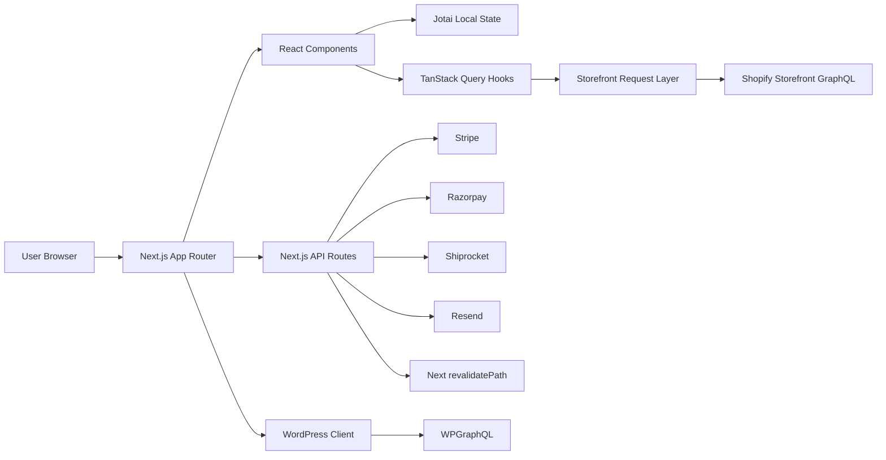
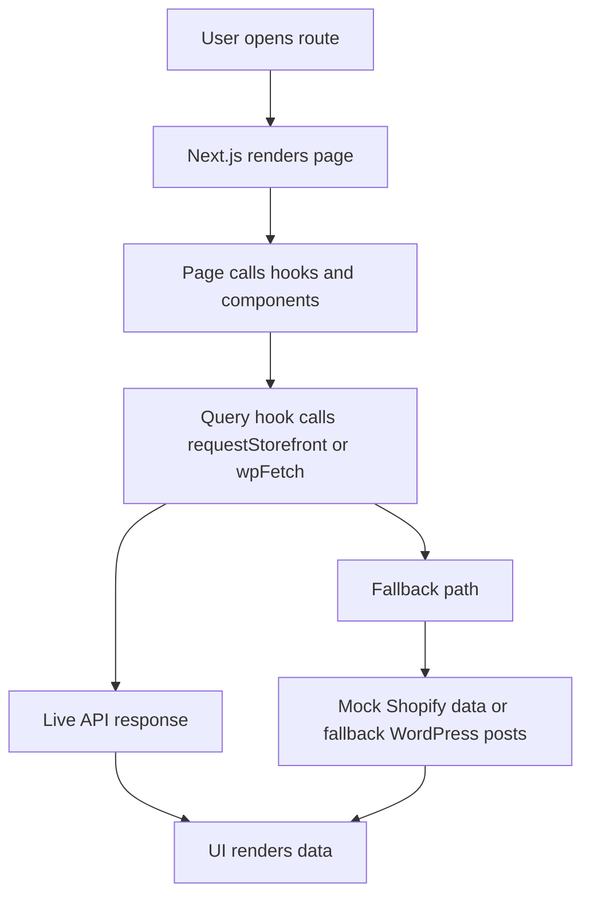
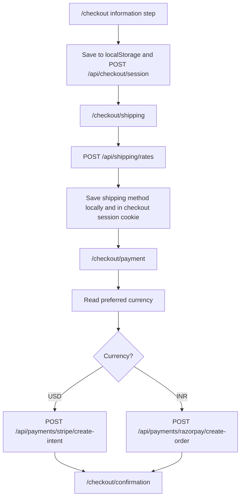
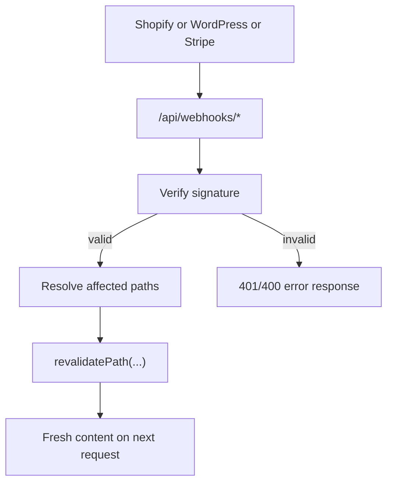
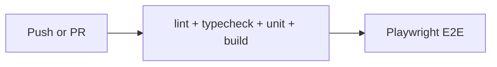

# Commergia

Commergia is a full ecommerce web app that combines:
- Shopify for products, variants, cart data, and customer auth
- WordPress for blog and editorial content
- Next.js for the storefront UI, APIs, and deployment runtime

This README is a full project guide written in plain language.

## 1) What You Get

Commergia includes:
- A modern storefront (`/`, `/collections/[handle]`, `/product/[handle]`)
- Search, filters, predictive suggestions, and recently viewed products
- Cart drawer + full cart page with quantity updates
- Multi-step checkout (`information -> shipping -> payment -> confirmation`)
- Currency-aware payment routing:
  - `USD -> Stripe`
  - `INR -> Razorpay`
- Account dashboard, profile updates, orders view, wishlist
- Blog pages backed by WordPress GraphQL with safe fallback content
- Contact and newsletter flows via Resend
- Shipping rates and tracking via Shiprocket (with fallback responses)
- Webhook endpoints for Shopify, WordPress, and Stripe revalidation
- Unit tests (Vitest), E2E tests (Playwright), and Lighthouse CI checks

## 2) High-Level Architecture



## 3) Runtime Flow (Page + Data)



Fallback behavior is intentional:
- If Shopify keys are missing, storefront requests can run in mock mode.
- If WordPress is unavailable, blog pages can render fallback posts.
- If payment keys are missing, payment endpoints return mock payment objects.
- If Shiprocket is unavailable, shipping APIs return static fallback rates/checkpoints.

## 4) Checkout Flow



## 5) Webhook and Revalidation Flow



## 6) Tech Stack (Plain View)

- Framework: Next.js 15 (App Router)
- Language: TypeScript
- Styling: Tailwind CSS
- UI primitives: Radix + custom UI wrappers in `src/components/ui`
- Data fetching/cache: TanStack Query
- Local app state: Jotai
- Forms and validation: React Hook Form + Zod
- Payments: Stripe and Razorpay
- Shipping: Shiprocket
- Email: Resend
- Testing: Vitest + Playwright
- Performance checks: Lighthouse CI

## 7) Repository Map

```text
.
|- src/
|  |- app/                    # App Router pages + API routes
|  |- components/
|  |  |- commerce/            # Cart, checkout, filters, search, wishlist
|  |  |- content/             # Blog card, forms, faq, newsletter, social share
|  |  |- layout/              # Header, footer, menu, breadcrumbs, sticky CTA
|  |  |- ui/                  # Reusable UI primitives
|  |  |- view/                # Product card/carousel/options and auth forms
|  |- graphql/                # Shopify and WordPress GraphQL docs
|  |- hooks/                  # Client hooks for auth, search, shipping, etc
|  |- lib/
|  |  |- api/                 # Response envelope, validation, signatures, revalidation
|  |  |- atoms/               # Jotai state modules
|  |  |- integrations/        # Stripe, Razorpay, Shiprocket, Resend
|  |  |- mocks/               # Mock storefront logic
|  |  |- seo/                 # Metadata + JSON-LD schema helpers
|  |  |- storefront/          # Storefront request wrapper
|  |  |- wordpress/           # WordPress fetch and sanitization
|  |- providers.tsx           # QueryClient provider
|- tests/
|  |- unit/
|  |- e2e/
|- .github/workflows/         # CI, deploy, lighthouse workflows
|- Dockerfile
|- docker-compose.yml
|- DEPLOYMENT.md
```

## 8) Route Catalog

### Public pages

| Route | Purpose | Main Data Source |
|---|---|---|
| `/` | Home page with trending products and marketing sections | Shopify (`GET_TRENDING_PRODUCTS_QUERY`) |
| `/collections/[handle]` | Product listing page with filters, sort, pagination, grid/list view | Shopify (`GET_COLLECTION_BY_HANDLE_WITH_PAGINATION_QUERY`) |
| `/product/[handle]` | Product details, options, add-to-cart, reviews, recommendations | Shopify (`GET_PRODUCT_BY_HANDLE_QUERY`) |
| `/search` | Search results with filters and sort | Shopify (`SEARCH_PRODUCTS_QUERY`) |
| `/cart` | Full cart page with summary and recently viewed | Shopify cart + local storage |
| `/checkout` | Checkout information step | local storage + `/api/checkout/session` |
| `/checkout/shipping` | Shipping method step | `/api/shipping/rates` |
| `/checkout/payment` | Payment initialization step | Stripe or Razorpay API route |
| `/checkout/confirmation` | Confirmation screen with final params | Query params + local storage |
| `/auth` | Login or signup | Shopify customer mutations |
| `/auth/reset/[token]` | Password reset by Shopify reset URL token | Shopify `CUSTOMER_RESET_BY_URL` |
| `/about` | Project/about page | local static data |
| `/contact` | Contact info + form | `/api/contact` |
| `/faq` | FAQ page + FAQ schema markup | local static data |
| `/blog` | Blog index page | WordPress GraphQL or fallback posts |
| `/blog/[slug]` | Blog article page | WordPress GraphQL or fallback post |
| `/robots.txt` | Robots policy | generated from `siteConfig` |
| `/sitemap.xml` | Sitemap routes | generated route list |

### Protected pages

`/account` routes are guarded by middleware using the `customerAccessToken` cookie.

| Route | Purpose |
|---|---|
| `/account` | Dashboard, profile edit, recent orders summary, wishlist count |
| `/account/orders` | Full orders list with expandable details |
| `/account/wishlist` | Wishlist products loaded by handles |

## 9) API Endpoint Catalog

All APIs use a shared response shape from `src/lib/api/response.ts`.

### Success response
```json
{
  "ok": true,
  "correlationId": "uuid",
  "data": {}
}
```

### Error response
```json
{
  "ok": false,
  "correlationId": "uuid",
  "error": {
    "code": "ERROR_CODE",
    "message": "Human readable message",
    "details": {}
  }
}
```

### Endpoints

| Endpoint | Method | What it does |
|---|---|---|
| `/api/checkout/session` | `GET` | Reads checkout session from httpOnly cookie (`checkout_session`) |
| `/api/checkout/session` | `POST` | Merges and saves checkout data into `checkout_session` cookie |
| `/api/contact` | `POST` | Validates contact form and sends email via Resend |
| `/api/email` | `POST` | Generic transactional email sender via Resend |
| `/api/newsletter` | `POST` | Accepts newsletter signup (uses Resend when configured) |
| `/api/revalidate` | `POST` | Protected revalidation endpoint with secret check |
| `/api/payments` | `POST` | Currency-based payment router: USD -> Stripe, INR -> Razorpay |
| `/api/payments/stripe` | `POST` | Create Stripe payment intent (USD only) |
| `/api/payments/stripe/create-intent` | `POST` | Stripe intent creation endpoint (USD only) |
| `/api/payments/stripe/webhook` | `POST` | Stripe webhook verify + revalidate account orders |
| `/api/payments/razorpay` | `POST` | Create Razorpay order (INR only) |
| `/api/payments/razorpay/create-order` | `POST` | Razorpay order creation endpoint (INR only) |
| `/api/payments/razorpay/verify` | `POST` | Verifies Razorpay payment signature |
| `/api/shipping/rates` | `POST` | Returns Shiprocket rates or fallback rate cards |
| `/api/shipping/track/[id]` | `GET` | Returns tracking checkpoints (live or fallback timeline) |
| `/api/webhooks/[provider]` | `POST` | Unified webhook endpoint for stripe/shopify/wordpress |
| `/api/webhooks/shopify` | `POST` | Shopify-specific webhook endpoint |
| `/api/webhooks/stripe` | `POST` | Stripe-specific webhook endpoint |
| `/api/webhooks/wordpress` | `POST` | WordPress-specific webhook endpoint |

## 10) Data Sources and Integrations

| System | Used for | Code location |
|---|---|---|
| Shopify Storefront GraphQL | Products, collections, cart, customer auth/profile/orders | `src/graphql/*`, `src/lib/storefront/request.ts` |
| WordPress GraphQL | Blog posts and pages | `src/lib/wordpress/client.ts`, `src/graphql/wordpress/*` |
| Stripe | USD payment intents and webhooks | `src/lib/integrations/stripe.ts`, `/api/payments/stripe*` |
| Razorpay | INR orders and signature verification | `src/lib/integrations/razorpay.ts`, `/api/payments/razorpay*` |
| Shiprocket | Shipping rates and tracking | `src/lib/integrations/shiprocket.ts`, `/api/shipping/*` |
| Resend | Contact, newsletter, and email endpoints | `src/lib/integrations/resend.ts`, `/api/contact`, `/api/email`, `/api/newsletter` |

## 11) State, Cookies, and Local Storage

### Jotai state

| Module | Purpose |
|---|---|
| `auth.tsx` | Current auth token and email |
| `cart.tsx` | Cart object and cart actions |
| `checkout.tsx` | Checkout step, form info, shipping method |
| `wishlist.tsx` | Wishlist handles with persistence helpers |
| `search.tsx` | Search query and search history |
| `currency.tsx` | Selected currency (`USD` or `INR`) |
| `ui.tsx` | UI-only state (cart drawer open/close) |

### Cookies

| Cookie | Created by | Purpose |
|---|---|---|
| `customerAccessToken` | auth login/reset | Customer session for account routes |
| `preferredCurrency` | middleware / currency switch | Currency preference (`USD` or `INR`) |
| `checkout_session` | `/api/checkout/session` | Server-side checkout session snapshot (httpOnly) |

### Local storage keys

| Key | Purpose |
|---|---|
| `cartId` | Persist Shopify cart id between sessions |
| `wishlist_handles` | Saved wishlist handles |
| `checkout_information` | Checkout step 1 fields |
| `checkout_shipping` | Selected shipping method |
| `recently_viewed_handles` | Recently viewed product handles |

## 12) Middleware and Security Headers

`middleware.ts` currently does the following:
- Protects `/account*` routes (redirects unauthenticated users to `/auth`)
- Protects selected API prefixes (`/api/account`, `/api/customer`, `/api/orders`, `/api/wishlist`)
- Sets default currency cookie by country (`IN -> INR`, otherwise `USD`)
- Adds Content Security Policy response header
- Adds API response headers: `X-RateLimit-Limit` and `X-RateLimit-Window`

`next.config.ts` adds global security headers:
- `X-Frame-Options: SAMEORIGIN`
- `X-Content-Type-Options: nosniff`
- `Referrer-Policy: strict-origin-when-cross-origin`
- `Permissions-Policy: camera=(), microphone=(), geolocation=(self)`

Redirects:
- `/products/:handle -> /product/:handle`
- `/collection/:handle -> /collections/:handle`

## 13) Local Setup (Step by Step)

### Requirements
- Node.js 20+
- npm 10+

### Install
```bash
npm install
```

### Configure environment
```bash
cp .env.example .env.local
```

Fill `.env.local` values based on the table in Section 14.

### Run development server
```bash
npm run dev
```

Open:
- `http://localhost:3000`

### Optional: generate Shopify GraphQL types
```bash
npm run codegen
```

Note: codegen requires Shopify endpoint and token variables to be set.

## 14) Environment Variables

`/.env.example` is the source of truth.

### Shopify

| Variable | Required | Purpose |
|---|---|---|
| `NEXT_PUBLIC_SHOPIFY_STORE_DOMAIN` | Yes for live Shopify | Store domain (`your-store.myshopify.com`) |
| `NEXT_PUBLIC_SHOPIFY_STORE_API_URL` | Yes for live Shopify | GraphQL endpoint URL |
| `NEXT_PUBLIC_SHOPIFY_STOREFRONT_ACCESS_TOKEN` | Yes for live Shopify | Storefront token |
| `SHOPIFY_ADMIN_ACCESS_TOKEN` | Optional currently | Reserved for admin-side operations |
| `SHOPIFY_WEBHOOK_SECRET` | Required for webhook verify | Verifies Shopify webhook signatures |

### WordPress

| Variable | Required | Purpose |
|---|---|---|
| `NEXT_PUBLIC_WORDPRESS_API_URL` | Yes for live WP | WPGraphQL endpoint |
| `WORDPRESS_WEBHOOK_SECRET` | Required for webhook verify | Verifies WordPress webhook signatures |

### Stripe

| Variable | Required | Purpose |
|---|---|---|
| `NEXT_PUBLIC_STRIPE_PUBLISHABLE_KEY` | Client usage | Stripe publishable key |
| `STRIPE_SECRET_KEY` | Required for real payments | Stripe server key |
| `STRIPE_WEBHOOK_SECRET` | Required for webhook verify | Stripe webhook signature secret |

### Razorpay

| Variable | Required | Purpose |
|---|---|---|
| `NEXT_PUBLIC_RAZORPAY_KEY_ID` | Client usage | Razorpay key id |
| `RAZORPAY_KEY_SECRET` | Required for real payments | Razorpay key secret |

### Shipping

| Variable | Required | Purpose |
|---|---|---|
| `SHIPROCKET_EMAIL` | Optional | Shiprocket auth |
| `SHIPROCKET_PASSWORD` | Optional | Shiprocket auth |

### Email and contact

| Variable | Required | Purpose |
|---|---|---|
| `RESEND_API_KEY` | Optional | Resend client auth |
| `RESEND_FROM_EMAIL` | Optional | Sender identity |
| `CONTACT_TO_EMAIL` | Optional | Contact form destination |
| `NEWSLETTER_SIGNUP_SECRET` | Optional | Reserved newsletter hardening value |

### App and analytics

| Variable | Required | Purpose |
|---|---|---|
| `NEXT_PUBLIC_SITE_URL` | Yes in production | Canonical URL base |
| `NEXT_PUBLIC_CONTACT_MAP_EMBED_URL` | Optional | Contact page map iframe |
| `NEXT_PUBLIC_GA_MEASUREMENT_ID` | Optional | Analytics measurement id |
| `REVALIDATION_SECRET` | Required for secure revalidate route | Protects `/api/revalidate` |

### Optional mock toggle

| Variable | Required | Purpose |
|---|---|---|
| `NEXT_PUBLIC_USE_MOCK_STOREFRONT=true` | Optional | Force mock storefront data even if Shopify keys exist |

## 15) NPM Scripts (What Each One Does)

| Command | What it does |
|---|---|
| `npm run dev` | Starts Next.js dev server |
| `npm run build` | Creates production build |
| `npm run start` | Runs production server from build output |
| `npm run lint` | Runs Next.js ESLint checks |
| `npm run typecheck` | Runs TypeScript without emit |
| `npm run test` | Runs Vitest unit tests once |
| `npm run test:unit` | Same as `test` |
| `npm run test:watch` | Runs Vitest in watch mode |
| `npm run test:coverage` | Runs unit tests with coverage output |
| `npm run test:e2e` | Runs Playwright E2E tests |
| `npm run test:all` | Runs unit then E2E tests |
| `npm run codegen` | Regenerates Shopify GraphQL types |
| `npm run test:lighthouse` | Runs Lighthouse CI via helper script |

## 16) Testing Coverage

### Unit tests (`tests/unit`)
- API payload validation schemas
- Signature verification helpers
- Cart helper calculations
- Checkout atom state transitions
- Wishlist hydration/toggle behavior

### E2E tests (`tests/e2e`)
- Auth flow: register -> login -> account -> logout
- Catalog flow: collection page to product page
- Cart flow: add -> update quantity -> remove
- Checkout flow: information -> shipping -> payment -> confirmation
- Search flow: query, filter, sort
- Account flow: profile update + order row expansion

### Test setup notes
- `vitest` uses `happy-dom`
- `playwright` runs desktop + mobile projects
- E2E local web server sets `NEXT_PUBLIC_USE_MOCK_STOREFRONT=true` by default

## 17) CI and Deploy Automation

### CI workflow (`.github/workflows/ci.yml`)



### Lighthouse workflow (`.github/workflows/lighthouse.yml`)
- Builds app
- Runs Lighthouse against key routes:
  - `/`
  - `/collections/men`
  - `/product/classic-oxford-shirt`
  - `/search?q=shirt`
  - `/checkout`

### Deploy workflow (`.github/workflows/deploy.yml`)
- Runs on `main` push
- Deploys to Vercel when required secrets are present:
  - `VERCEL_TOKEN`
  - `VERCEL_ORG_ID`
  - `VERCEL_PROJECT_ID`

## 18) Deployment Options

### Option A: Vercel
1. Connect the GitHub repo.
2. Add all needed environment variables.
3. Deploy using default Next.js settings.

### Option B: Docker

Build and run:
```bash
docker build -t commergia:latest .
docker run -p 3000:3000 --env-file .env.local commergia:latest
```

Or compose:
```bash
docker compose up -d
```

Dockerfile uses multi-stage build and outputs a lean runtime image with Next standalone output.

## 19) Notes About Fallback and Mock Behavior

This project is designed to keep working during partial setup:
- Missing Shopify keys -> mock storefront data can still power catalog/cart/auth flows
- Missing Resend key -> contact/newsletter can still return success paths with local provider labels
- Missing Shiprocket creds -> shipping uses fallback rates/tracking timeline
- Missing Stripe/Razorpay keys -> payment endpoints can return mock ids for UI flow testing

This helps local development and demos before all production secrets are ready.

## 20) Common Troubleshooting

| Problem | Likely cause | What to check |
|---|---|---|
| Product pages show mock data only | Shopify env not set | `NEXT_PUBLIC_SHOPIFY_STORE_API_URL`, token, mock toggle |
| Blog page not loading live posts | WordPress endpoint not set/reachable | `NEXT_PUBLIC_WORDPRESS_API_URL` and WPGraphQL availability |
| Stripe webhook verification fails | Missing/incorrect webhook secret | `STRIPE_WEBHOOK_SECRET` and signature header |
| Razorpay verify route returns not configured | Missing secret | `RAZORPAY_KEY_SECRET` |
| Shipping endpoint always fallback | Shiprocket login failed | `SHIPROCKET_EMAIL`, `SHIPROCKET_PASSWORD` |
| Account routes redirect to auth | Missing customer cookie | `customerAccessToken` cookie and login flow |
| `npm run codegen` fails | Shopify schema endpoint/token missing | Required Shopify env variables |

## 21) Extra Project Docs

- Full operations manual: `DEPLOYMENT.md`
- Cross-repo migration notes: `docs/CROSS_REPO_MIGRATION.md`
- Progress and planning docs:
  - `MERGER_PLAN.md`
  - `REMAINING_WORK_100.md`

## 22) License

MIT
